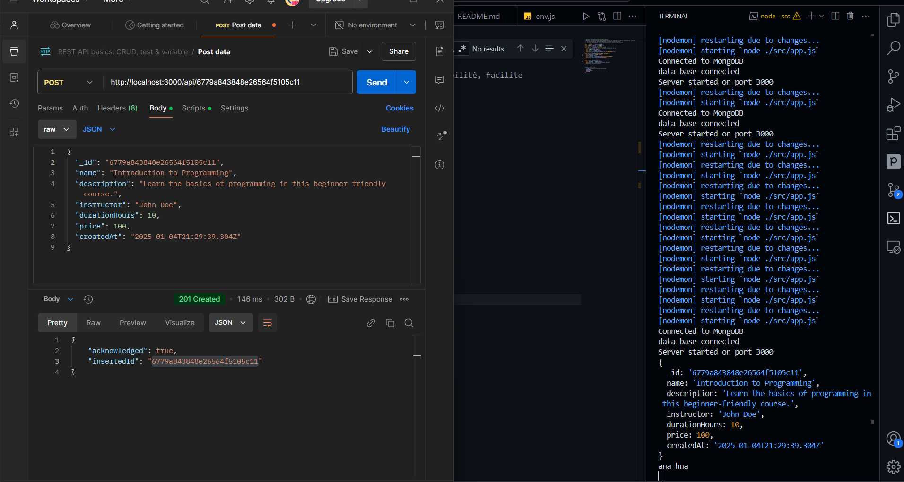
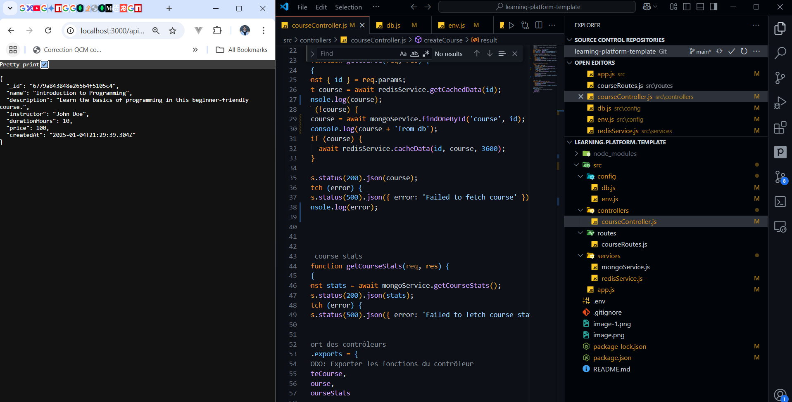
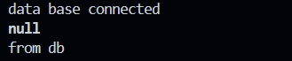
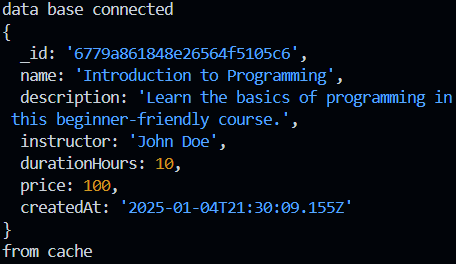

# **KARROUM HOUSSAM**  

## **Statut du Projet : Terminé**  
- Ajout du code correct dans `redisservice.js`.  
- Mise à jour de la fonction pour obtenir le client Redis.  

---

## **Projet de Fin de Module : NoSQL**  
### projet termine => next step is clean code with console.log ...
### **1. Choix Techniques**  

#### **Service Backend**  
=> making sure api/ works after installing postman to test it and it working

- **Statut** : **Terminé**  
- **Détails :**  
  - **Fichier `app.js` :**  
    - Code implémenté correctement, le serveur fonctionne. Les réponses aux questions seront ajoutées après.  
    -   

  - **Fichier `db.js` :**  
    - Ajout des fonctions :  
      - `closeMongo`  
      - `closeRedis`  

  - **Fichier `coursecontroller.js` :**  
    - Correction des erreurs dans `coursecontroller`.  
    - Ajout de logs pour identifier et résoudre les problèmes plus efficacement.  
  - **Fichier `redisservice.js` :**  
    - Ré-implémentation de `getCachedData` pour obtenir les bonnes données.  
      - **Premier appel :** Les données proviennent de la base de données (non mises en cache).  
          
      - **Deuxième appel :** Les données proviennent du cache.  
          

#### **Implémentation des fonctionnalités dans `coursecontroller`**  
- `getCourseStats`  
- `getCourse`  
- `createCourse`  

---

### **2. Ajout de Tests**  
- **Statut : Terminé**  

---

## **Réponses aux Questions Techniques**  

### **Fichier `redisService.js`**  
- Réponses incluses dans les commentaires et documentations associées.  
- **Statut : Terminé**
### **Fichier `tout les fichier sauf app`**  
- Réponses incluses dans les commentaires et documentations associées.  
- **Statut : Terminé**    

## **Auteur**  
- **Houssam Karroum** - Développeur  

--- 
