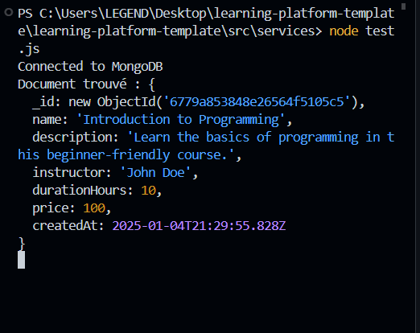

## KARROUM HOUSSAM ##
#### Done
i have added the correct code to mongoservice.js also i add a function to get the db and i removed all console display in the previous files db, env and .env

# Projet de fin de module NoSQL

# Choix Techniques 
### 1. ajouter une function pour returner la base de donnee
````javascript
function getdb() {
  if ((!db)) {
    throw new Error("mongodb not found not connected")
  } else {
    return db;
  }
}
````

### 2. crearer un fichier test.js just pour tester le servces avec un example



### ajout de test 

---
## 1. repond au question 
file mongoservice.js Done

### Pour le rendu, voici ce que j'attends :
1. Un dépôt public sur Github avec un historique de commits clair :> Done
2. Un README.md qui explique :
   - Comment installer et lancer le projet
   - La structure du projet
   - Les choix techniques que vous avez faits

### Je vous conseille de procéder étape par étape :
1. Commencez par lire et comprendre la structure du projet
2. Répondez aux questions des commentaires dans le README
3. Implémentez progressivement les TODOs
4. Testez chaque fonctionnalité au fur et à mesure
5. Documentez vos choix et vos réflexions en ajoutant des copies d'écrans à votre fichier README.md

#### Auteurs
Houssam Karroum - Développeur