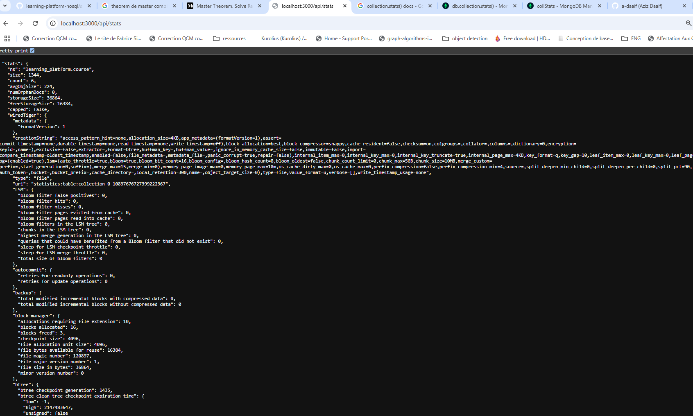
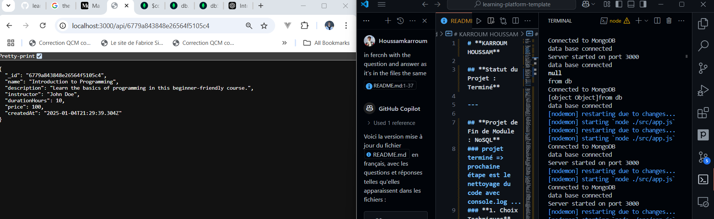
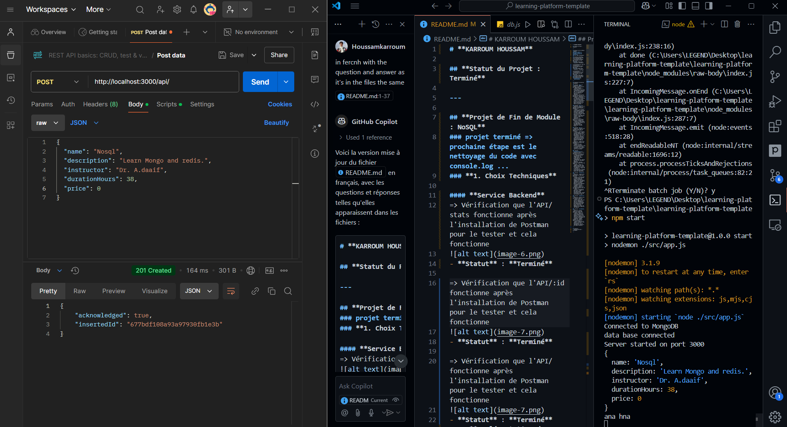

# **KARROUM HOUSSAM**

## **Statut du Projet : Terminé**

## **Instructions pour Exécuter le Projet**

1. **Installer les dépendances :**
   ```sh
   npm install
2. **Démarrer le serveur :**
   ```sh
   npm start
3. **Ouvrir l'interface utilisateur :**
   *Faites un clic droit sur index.html et choisissez "Open with Live Server" pour ouvrir l'interface utilisateur.*

## Demo ##
<video width="320" height="240" controls>
  <source src="" type="video/mp4">
</video>
(https://youtu.be/Ovq0e8nHYCQ "demo in youtube")
---

## **Projet de Fin de Module : NoSQL**
### projet terminé => prochaine étape est le nettoyage du code avec console.log ...
### **1. Choix Techniques**

#### **Service Backend**
=> Vérification que l'API/stats fonctionne après l'installation de Postman pour le tester et cela fonctionne

- **Statut** : **Terminé**

=> Vérification que l'API/:id fonctionne après l'installation de Postman pour le tester et cela fonctionne

- **Statut** : **Terminé**

=> Vérification que l'API/ fonctionne après l'installation de Postman pour le tester et cela fonctionne

- **Statut** : **Terminé**
#### **Implémentation des fonctionnalités dans `coursecontroller`**
- `getCourseStats`

---

## **Réponses aux Questions Techniques**

### **Fichier `app.js`**
- **Question: Comment organiser le point d'entrée de l'application ?**
  - Réponse: Organisez le point d'entrée de l'application en regroupant les différentes parties du code, en les initialisant et en les démarrant de manière ordonnée et cohérente.
- **Question: Quelle est la meilleure façon de gérer le démarrage de l'application ?**
  - Réponse: La meilleure façon de gérer le démarrage de l'application est de séparer les différentes étapes de l'initialisation, de gérer les erreurs de manière appropriée et de démarrer le serveur de manière asynchrone.

### **Fichier `env.js`**
- **Question: Pourquoi est-il important de valider les variables d'environnement au démarrage ?**
  - Réponse : Les variables d'environnement contiennent toujours des variables et des données sensibles et cruciales (comme les URL, les services externes comme API_key) et si ces variables ne sont pas bien validées, l'application risque de ne pas fonctionner.
- **Question: Que se passe-t-il si une variable requise est manquante ?**
  - Réponse : L'application ne fonctionnera pas parfois et lancera des erreurs, ou des comportements inattendus ainsi que parfois des résultats erronés.

### **Fichier `db.js`**
- **Question : Pourquoi créer un module séparé pour les connexions aux bases de données ?**
  - Réponse : Centralisation et réutilisation : Code de connexion regroupé en un seul endroit, facilitant la maintenance et la réutilisation. Abstraction : Isolation du reste de l'application des détails spécifiques de la base de données, permettant un changement de SGBD plus aisé.
- **Question : Comment gérer proprement la fermeture des connexions ?**
  - Réponse : Il faut : Fermeture explicite : Utiliser les fonctions close() ou équivalentes après utilisation. try...finally : Garantir la fermeture même en cas d'erreur.

### **Fichier `courseController.js`**
- **Question: Quelle est la différence entre un contrôleur et une route ?**
  - Réponse: Un contrôleur est responsable de la logique métier de l'application, tandis qu'une route est responsable de l'acheminement des requêtes HTTP vers les contrôleurs appropriés.
- **Question : Pourquoi séparer la logique métier des routes ?**
  - Réponse : Séparer la logique métier des routes permet de rendre le code plus modulaire, plus facile à maintenir et à tester, et de faciliter la réutilisation de la logique métier dans différentes parties de l'application.

### **Fichier `redisService.js`**
- **Question : Comment gérer efficacement le cache avec Redis ?**
  - Réponse : Définissez des stratégies pour invalider le cache lorsque les données sous-jacentes changent. Pour des données volumineuses, envisagez de compresser les données avant de les stocker. Mettez en cache uniquement les données qui sont fréquemment accédées ou coûteuses à calculer.
- **Question: Quelles sont les bonnes pratiques pour les clés Redis ?**
  - Réponse : Utilisez des noms de clés lisibles et descriptifs, comme user:123:profile. Conventions de Nom: Séparez les parties de la clé par des délimiteurs comme :.

### **Fichier `mongoService.js`**
- **Question: Pourquoi créer des services séparés ?**
  - Réponse: Créer des services séparés offre une clarté en organisant le code par responsabilité, facilite la réutilisation des fonctionnalités dans différentes parties du projet, assure une modularité en isolant les composants pour simplifier leur gestion.

### **Fichier `courseRoutes.js`**
- **Question: Pourquoi séparer les routes dans différents fichiers ?**
  - Réponse : Séparer les routes dans différents fichiers permet de mieux organiser le code, de le rendre plus modulaire et de faciliter la maintenance et l'extension du projet.
- **Question : Comment organiser les routes de manière cohérente ?**
  - Réponse: Organisez les routes en fonction de leur contexte ou de leur fonctionnalité, en les regroupant par domaine ou par type de ressource.

---

## **Auteur**
- **Houssam Karroum** - Développeur

---