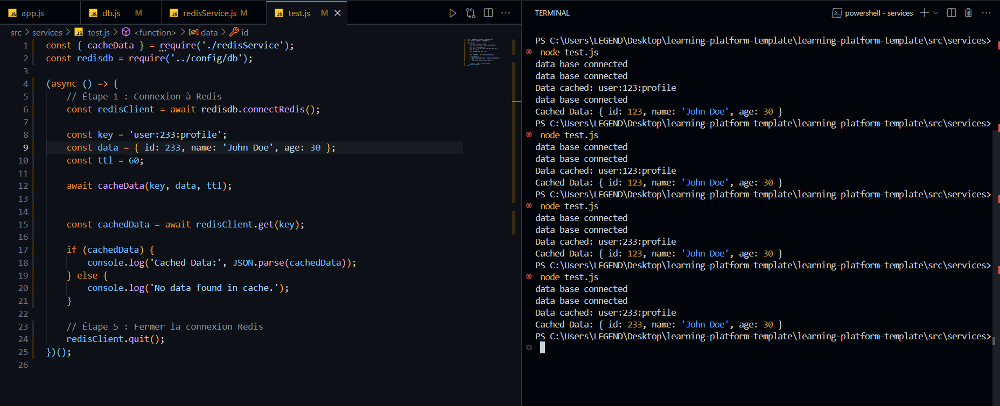

# **KARROUM HOUSSAM**  

### **Statut du Projet**  
- **Done**  
  - Ajout du code correct dans `redisservice.js`.  
  - Ajout d'une return a une fonction pour obtenir redis client.  

---

## **Projet de Fin de Module NoSQL**  

---

### **Choix Techniques**

#### 1. **Ajout du retour du client Redis dans le fichier `db.js` dans `config`**  
   - **Status** : *Done*

#### 2. **Création d'un fichier `test.js` pour tester les services avec un exemple**  
   - **Status** : *Done*  
   - 

#### 3. **Ajout de tests**  
   - **Status** : *Done*

---

### **Réponses aux questions**  

#### 1. **Répondre aux questions dans le fichier `redisService.js`**  
   - **Status** : *Done*

---

## **Pour le rendu, voici ce que j'attends** :  

1. **Un dépôt public sur Github avec un historique de commits clair**  
   - **Status** : *Done*

2. **Un fichier README.md qui explique :**  
   - Comment installer et lancer le projet  
   - La structure du projet  
   - Les choix techniques faits  

---

### **Conseils de réalisation :**

1. Commencez par lire et comprendre la structure du projet.  
2. Répondez aux questions dans le fichier README.  
3. Implémentez progressivement les TODOs.  
4. Testez chaque fonctionnalité au fur et à mesure.  
5. Documentez vos choix et vos réflexions, en ajoutant des captures d'écran dans votre README.md.  

---

### **Auteurs**  
- **Houssam Karroum** - Développeur  

--- 
